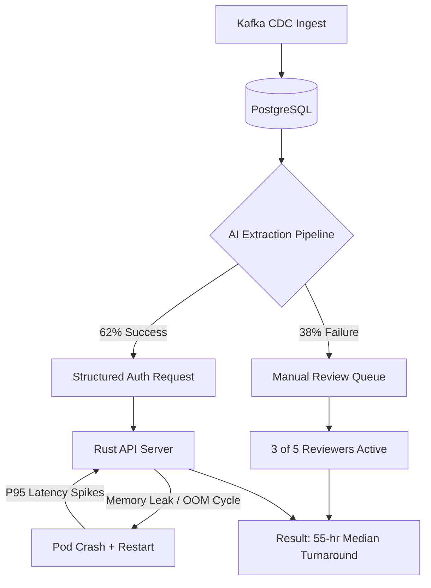

## Cursor's Assessment vs. Claude's Version
- Agreed with (independently confirmed):
  - README overstates "ML Scoring Service" maturity; the schema added `ml_confidence_score` but no implementation exists in this repo (see `repo/README.md:24-37` and `repo/migrations/007_add_ml_confidence.sql:1-9`; also Issue #15 in `repo/ISSUES.md:229-241`).
  - AI extraction plateau and failure-mode mix is the dominant constraint on KR math (Grafana Panel 3 + OKR KR2 in `artifacts/grafana-dashboard.md:41-58` and `artifacts/okr-snapshot.md:10-24`).
  - Pipeline CI is disabled (Slack Thread #2 in `artifacts/slack-threads.md:28-42` and the disabled workflow header in `repo/.github/workflows/pipeline-test.yaml.disabled:1-3`).
  - Queue is FIFO today; urgency isn't used in ordering (Issue #26 in `repo/ISSUES.md:395-406`; code `ORDER BY submitted_at ASC` in `repo/crates/core/src/data/queries.rs:69-72`).
  - PHI exposure risk exists in debug logs (debug log statement in `repo/crates/core/src/data/queries.rs:42`; PR #54 description in `repo/PULL-REQUESTS.md:102-125`).
- Disagreed with or modified:
  - **Auto-approve endpoint is not present in the current repo**. PR #53 references `crates/api/src/endpoints/v1/auto_approve.rs` and a new migration 009, but this repo snapshot does not include that file and `api.rs` does not register `/api/v1/auto-approve/run` (`repo/PULL-REQUESTS.md:95-99` vs `repo/crates/api/src/api.rs:7-31` and `repo/crates/api/src/endpoints/v1` file list).
  - **DB pool "max connections" is read but not applied**. `DATABASE_MAX_CONNECTIONS` is parsed, but the pool is created with `PgPool::connect` and never configured (`repo/crates/core/src/data/mod.rs:5-13`). So Issue #2's suspicion about "pool size 10" is directionally right, but the code-as-written doesn't enforce it; any "pool size" claims must be treated as INFERENCE unless confirmed elsewhere.
- Added:
  - Release workflow references a `values-dev.yaml` that is missing from this repo snapshot, creating an "ops reality gap" similar to the runbook drift (release step references `infra/helm/values-dev.yaml` in `repo/.github/workflows/release.yaml:28-33`; file absence is a verifiable repo fact).
  - Pipeline config fragmentation is not just "multiple sources"; it is explicitly contradictory with the YAML noting "config.py takes precedence" (see `repo/pipeline/config.yaml:1-14` vs `repo/pipeline/config.py:3-14`), and the runtime entrypoint (`pipeline/src/batch_runner.py`) imports `pipeline.config` directly (`repo/pipeline/src/batch_runner.py:9-12`).

---

# Product Archaeology: Auth Review Assistant

**Author:** Rohan Tejaswi | **Date:** April 2026 | **Prepared for:** Machinify — Senior PM, Core Platform Take-Home

## 1. What Is This Product, Who Uses It, and What's the Architecture?

The Auth Review Assistant is an AI-powered clinical workflow tool that helps insurance payers process prior authorization requests faster using OCR + LLM extraction.

**Users**

Two user groups are visible from the artifacts:

- **Clinical Reviewers** (5 total, 3 currently active — Grafana Panel 6): Named reviewers — Maria Torres, James Park, Aisha Williams — filed Issues #7, #14, #22, and #26, revealing a small team experiencing compounding daily friction.
- **Clinical Ops Leadership** (VP Clinical Ops, Slack Thread #5): Escalated directly on March 28 about auto-approve. Zero response — a business risk as much as a product gap.

**Architecture: Claimed vs. Observed**

README depicts six components: Rust/Axum API, Kafka CDC ingestor, PostgreSQL, backfill worker, Python OCR+LLM pipeline, and an "ML Scoring Service." **The ML Scoring Service does not exist.** `migrations/007_add_ml_confidence.sql` added the column, but Issue #15 confirms no code reads or writes it. The PRD lists it as Phase 2 / NOT STARTED.

<!-- INSERT DIAGRAM: Render the Mermaid diagram from the end of this file to PNG and place here -->



## 2. What Does the Repo Tell You That the README Doesn't?

**Finding 1: The queue is FIFO — urgency is ignored.** `queries.rs:69–72` orders by `ORDER BY submitted_at ASC`. This directly causes the problem in Slack Thread #3: reviewers spend 10–15 minutes every morning finding urgent surgical pre-auths buried behind routine lab work. Fixing this is one SQL clause.

**Finding 2: PHI encryption is negated by a debug log line.** The schema stores patient names encrypted as BYTEA using pgcrypto; `queries.rs` correctly decrypts in-query. Then at `queries.rs:42`:

```
log::debug!("Fetched auth request for patient: {} {}",
    request.patient_first_name, request.patient_last_name);
```

At `RUST_LOG=info` this isn't actively leaking — but the API pod OOM-crashes every ~48 hours (Issue #10), and PR #54 to fix it sits unreviewed.

**Finding 3: Kubernetes resource limits are dangerously tight.** `values.yaml` shows 64Mi request / 128Mi limit — directly explaining the OOM restart cycle (Grafana Panel 4: P95 spikes to 6–8s correlating with restarts; Slack Thread #1). Issue #12 requested an HPA and resource bump — unassigned.

**Finding 4: Pipeline CI has been disabled since December.** `.github/workflows/pipeline-test.yaml.disabled` — Jordan confirmed in Slack Thread #2: "the OCR mock was flaking so I disabled it… that was 4 months ago." Issue #16 (wrong LLM model running due to `config.py` vs `config.yaml` mismatch) was a direct consequence — `batch_runner.py` imports `pipeline.config` (Python defaults), not the YAML.

**Finding 5: Analytics endpoints will crash if called.** The turnaround endpoint is a `todo!()` macro (`analytics.rs:20–29`) — it panics in production. If the VP navigates there, it crashes the API pod.

## 3. What's Working and What's Broken?

**Working**

- Core workflow is live: reviewers process cases daily at 62% AI extraction rate (Grafana Panel 3). Phase 1 PRD items confirmed shipped.
- CDC ingestor is functionally stable; duplicates handled via idempotent upserts (Issue #4).

**Broken or Dangerously Degraded**

| Problem | Evidence |
|---------|----------|
| Turnaround worsening: 48→55 hrs (Critical) | Grafana P2; KR1 |
| Extraction plateaued 62%, 6 weeks (High) | Grafana P3; KR2 |
| PHI plaintext in debug logs (High) | queries.rs:42; PR #54 unreviewed |
| API pod OOM every ~48hrs (High) | Grafana P4; Issue #10; values.yaml |
| No urgency sort in queue (High) | queries.rs:69-72; Issues #26, #5 |
| No LLM retry logic (High) | Issue #11 |
| Analytics endpoints crash if called (Medium) | analytics.rs:20-29; Issue #19 |
| PR #47 approved, unmerged 45 days (Medium) | PULL-REQUESTS.md |
| CI disabled since December (Medium) | pipeline-test.yaml.disabled |
| Config split with contradictions (Medium) | Issue #16; config.py vs config.yaml |

## 4. The Single Most Important Problem: The Throughput Ceiling

The system is approaching a throughput crisis:

- **Volume:** ~200/day → ~340/day (+70% in 90 days, accelerating)
- **Active reviewers:** 5 → 3 (−40% in same window)
- **AI extraction:** flat at 62% for 6 weeks
- **Result:** median turnaround 48→55 hrs, moving away from 28-hour target

With 340 requests/day and 38% requiring manual review, that's ~130 manual cases/day across 3 reviewers — ~43 each. At 3%/week volume growth with flat capacity, 100-hour turnaround is reachable within 6–8 weeks.

The extraction ceiling is not a research problem — it's three known, unactioned fixes: PR #47 (approved, unmerged), Issue #11 (LLM retry, ~1 day), Issue #6 (PDF rotation, known solution). Fixing all three likely moves extraction from 62% to ~82–85%, unlocking auto-approve — the volume reduction the VP has been asking for.

## 5. What's Missing to Validate This Diagnosis

- **Why did 2 of 5 reviewers go inactive in mid-February?** The drop is real (Grafana Panel 6); the cause is not in any artifact.
- **What share of current backlog matches auto-approve CPT codes?** Distribution data is absent; ROI depends on routine-code prevalence.
- **Has legal reviewed auto-approve for state-specific prior auth regulations?** The PRD flagged this. No evidence a review happened.
- **Has `RUST_LOG=debug` ever been set in production during incident response?** The PHI log line exists; whether it has been activated is unknown.
